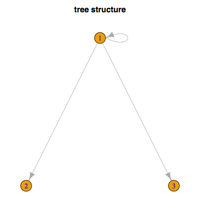
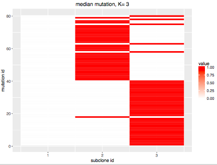
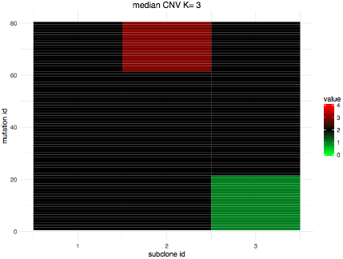
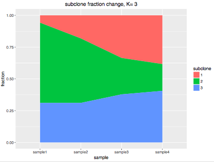

_SIFA_ (tumor **S**ubclone **I**dentification by **F**eature **A**llocation) is a Baysian method to identify tumor subclones using WGS data. This page will guide you through the basic steps of using _SIFA_.

Currently SIFA requires sample size to be at least two, since a unique tree cannot be identified with only one sample.

## Reference
_Zeng, L., Warren, J.L. and Zhao, H. (2017) Phylogeny-based tumor subclone identification using Bayesian feature allocation model_ [\[pdf\]]()

## Software dependencies
_SIFA_ is written in `R` and `C++`. Please install the following packages in R prior to implementing our software:

- data manipulation: `tidyr`,`reshape`,`dplyr`
- segment calling: `copynumber`
- Bayesian analysis: `coda`
- integrating `c++` functionality: `Rcpp`,`RcppArmadillo`
- visualization: `ggplot2`, `igraph`
- others: `gtools`


## Prepare software input

_SIFA_  takes an `.Rdata` file as input. 

The `.Rdata` file should contain a list `obs_data` with required fields: 

- `obs_data$D` for total reads matrix
- `obs_data$X` for mutant reads matrix
- `obs_data$loc` for mutation location matrix 
- `obs_data$segments` for loci segmentation matrix. 

When `obs_data$segments` is not provided, we will use the information provided in `obs_data$loc` and `obs_data$D` to call the genome segments.

**Input format**:

- `obs_data$D` and `obs_data$X` should take the following format:

	loci | sample 1 | sample 2 | sample 3 | ...
  ------- | --------- | -------- | -------- | --------
  locus 1 | 12 | 11 | 33  | ...
   locus 2 | 5 | 8 | 7 | ...
  ...    | ... | ... | ... | ... 
  locus J | 22 | 10 | 17 | ... 

- `obs_data$loc` should take the following format:

   chromosome | position | gene 
  ------- | --------- | -------- 
  1 | 7660469 |  CAMTA1
  3 | 88482840 | 
  13 | 102703724  |  FGF14 
  ...    | ... | ... 
  23 | 153383479 | 
For loci in non-coding regions, the `gene` column can be left blank. 

- `obs_data$segments` should take the following format:

  segments | start | end 
  ------- | --------- | -------- 
  segment 1 | 1 |  5 
  segment 2 | 6 |  25
  segment 3 | 26  |  40
  ...    | ... | ... 
  segment S |  155 | J
Each row of the matrix represents one segment, with the two entries marking the starting and ending locus of the segment.

## Using _SIFA_

To use _SIFA_, please set R working directory to `SIFA_package` after cloning this repository. Make sure you have all the dependencies correctly installed, load your input `.Rdata` file, and then open source code `SIFA_app.R` execute the commands line by line following the instructions below.

- In the _MODEL INPUT_ section of the code, load the `.Rdata` where your inputs are saved, specify random seed `myseed`, and specify the folder `foldername` to store output files (a new folder will be created if it does not exist). For example: 

	```r
	#############################################
	########## MODEL INPUT ######################
	#############################################
	load("example.Rdata")
	myseed = 1                # set random seed
	foldername = "temp_out"   # set output foldername
	dir.create(foldername)  # folder where outputs are saved
	```

- Next, you need to specify Bayesian sampling parameters in `specify_pars.R`. For most of the parameters, default values work just fine. Some of the parameters you can change are:

	```r
	#### maximum number of copy
	Params$max_CN=4
	#### maximum number of mutant copies
	Params$max_mut=2
	
	#### MCMC sampling parameters 
	MCMC_par$burnin=4000  # burnin sample size
	MCMC_par$Nsamp=4000   # number of samples for inference
	MCMC_par$Ntune=2000  # number of samples used for 	adaptive parameter tuning
	Nclone=c(3:7) # candidate subclone numbers K
	```

- run the remaining sections one by one:
	- `sampler.R` to perform sampling
	- `Model_select.R` to perform model selection. Plot of model selection will be saved in `selection.pdf`
	- `Fit_visual(foldername,X,D)` for results visualization:      
		- Visualization results will list top 3 frequent trees (when >= 3 tree structures exist) in posterior samples, and display corresponding parameter estimations.
	- `get_point_estimate()`:
		- get parameter point estimates from a given posterior sample `.Rdata` file
		- will identify up to top 3 trees from posterior samples, and calculate point estimates for each tree

During the sampling process, samples for each individual K will be stored in one `.Rdata` file.

## Results Examples
- Estimated phylogenetic tree:   



- Estimated subclone mutated copy numbers:    
 


- Estimated subclone total copy numbers:   



- Estimated subclone fractions across samples:  
 


## Contact
Please feel free to contact <li.zeng@yale.edu> if you have any question.